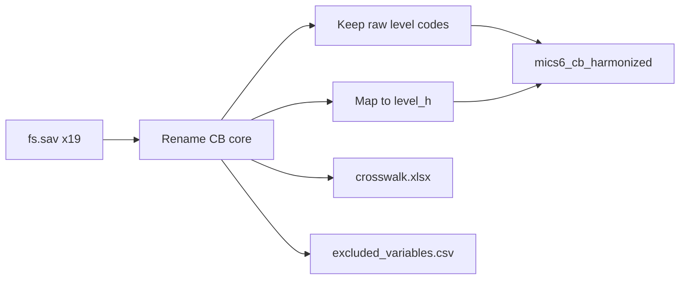

# Harmonize CB core schooling (R only)

## Decisions locked in
- **Theme:** Child's Background — **core schooling only**
- **Language:** R only (no Stata, no Bookdown chapter yet)
- **Naming:** rename to slim analysis names + add a **common education-level** variable (raw country codes kept)
- **Excel:** one row per harmonized variable; columns `harmonized_name`, `variable_label`, then one column per survey (`BEN_2021`, …) with the **source variable name** (blank if absent)

## Clarification still needed (education-level scheme)

Proposed common codes for `highest_level_h`, `current_level_h`, `previous_level_h` (and matching value labels):

| Code | Label |
|------|--------|
| 0 | Early childhood / pre-primary (ECE) |
| 1 | Primary |
| 2 | Lower secondary |
| 3 | Upper secondary |
| 4 | Vocational / technical (standalone track) |
| 5 | Higher / tertiary |
| 8 | Don't know |
| 9 | No response / other special |

**Open points for you to confirm before / during implementation:**
1. **Vocational placement:** When a survey nests tech/voc inside secondary (e.g. GHA `SSS/TECH`, NGA `VEI/IEI` / `SECONDARY TECHNICAL`, COD `SECONDAIRE 2 TECHN`), map to **3 (upper secondary)** or **4 (vocational)**?
2. **ZWE-style fine grain:** Map ZWE vocational/tertiary subtypes into 4 vs 5 only, or keep a richer harmonized scale for ZWE?
3. **TUN adult education (`CB5A=5`):** map to **5 (higher)**, **9 (other)**, or its own code?
4. **Grades (`CB5B`/`CB8B`/`CB10B`):** keep **raw country grades** only (recommended for v1), or also attempt a within-level harmonized grade?

Default if you do not answer before execution: vocational-in-secondary → **3**; ZWE subtypes collapsed to **4/5**; TUN adult ed → **9**; grades stay **raw**.

## Included vs excluded variables

**Included (harmonized):**

| Harmonized name | Typical source | Notes |
|-----------------|----------------|--------|
| `country_iso3`, `year` | folder name | same as reading |
| `cluster`, `hhno`, `linech`, `HH1`, `HH2`, `LN` | `HH1`/`HH2`/`LN` | merge keys to reading / IPUMS |
| `birth_month`, `birth_year` | `CB2M`, `CB2Y` | |
| `age` | `CB3` | same name as reading pipeline |
| `ever_attended` | `CB4` | |
| `highest_level` | `CB5A` | **raw** country codes + labels |
| `highest_grade` | `CB5B` | raw |
| `highest_completed` | `CB6` | |
| `enrolled` | `CB7` | current year |
| `current_level` | `CB8A` | raw |
| `current_grade` | `CB8B` | raw |
| `attended_previous` | `CB9` | |
| `previous_level` | `CB10A` | raw |
| `previous_grade` | `CB10B` | raw |
| `highest_level_h` | derived from `CB5A` | common scheme + labels |
| `current_level_h` | derived from `CB8A` | |
| `previous_level_h` | derived from `CB10A` | |

**Excluded (listed in a sidecar file, not in the analysis dataset):** all other `CB*` (and related) items, including but not limited to:
- Health insurance: `CB11`, `CB12*`, `CB13`, `CB14*`
- Country extras: LSO/SWZ vocational pathway `CB6B*`/`CB6C`; CAF `CB8AA`/`CB8BB`/`CB8CC`; SWZ `CB8AA`/`CB8B_INK`; MDG school-leaving / first-entry `CB12AB*`/`CB12AC`
- Non-CB modules entirely (CL, FCD, FCF, PR, FL, HP, FS panel beyond IDs)

Write the exclusion inventory as [`data/mics6_cb_excluded_variables.csv`](data/mics6_cb_excluded_variables.csv) (survey × source var × short reason).

## Implementation

Mirror the loop/helpers style of [`data/harmonize-mics-reading-v1.1.R`](data/harmonize-mics-reading-v1.1.R):

1. **New script:** [`data/harmonize-mics-cb-v1.0.R`](data/harmonize-mics-cb-v1.0.R)
2. Loop `data/MICS_Datasets/<ISO>_<YEAR>_*/fs.sav` over the same 18 ISO codes (both TUN years).
3. Per survey: `read_sav` → keep IDs + CB core → `cap_rename` → `ensure()` missing targets → apply **country-specific** `CB5A`/`CB8A`/`CB10A` → `*_level_h` maps → attach value labels (raw + harmonized).
4. `bind_rows` → write:
   - [`data/mics6_cb_harmonized.rds`](data/mics6_cb_harmonized.rds)
   - [`data/mics6_cb_harmonized.dta`](data/mics6_cb_harmonized.dta) (via `haven::write_dta`, for later Stata users even without a `.do` yet)
5. **Crosswalk Excel:** [`data/mics6_cb_variable_crosswalk.xlsx`](data/mics6_cb_variable_crosswalk.xlsx) via `openxlsx` / `writexl`:
   - Sheet `crosswalk`: `harmonized_name`, `variable_label`, then one column per survey with source names
   - Sheet `level_map` (optional but useful): country × raw code → `level_h` + raw label (documents the clarification decisions)
6. **Excluded list:** CSV as above (also optionally a second sheet in the workbook).

## Overlap with reading file
Reading already uses `age` / `ever_attended` / `enrolled` internally but drops them from the slim keep. CB file will **re-emit** them with the same names and merge keys so users can merge on `country_iso3`, `year`, `cluster`, `hhno`, `linech` (or `HH1`/`HH2`/`LN`). No change to the reading scripts.

## Out of scope for this pass
- Bookdown documentation chapter
- Stata twin script
- Other FS themes (CL, PR, FL numeracy, etc.)
- Harmonizing grade-within-level codes (unless you choose that in clarification #4)
