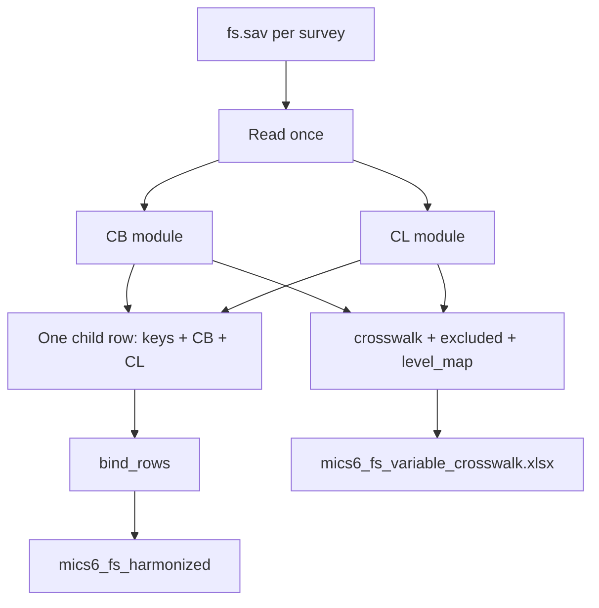

# Harmonize CL into one FS build

## Decisions locked in
- **CL scope:** core items only; rename + labels only (no derived child-labour indicators)
- **One analysis file** that grows by theme: [`data/mics6_fs_harmonized.{rds,dta}`](data/mics6_fs_harmonized.rds) — keys + CB + CL (+ future themes)
- **One documentation workbook:** [`data/mics6_fs_variable_crosswalk.xlsx`](data/mics6_fs_variable_crosswalk.xlsx)
  - `crosswalk` — `theme`, `harmonized_name`, `variable_label`, then survey columns (`BEN_2021`, …)
  - `excluded` — `theme`, `survey`, `country_iso3`, `year`, `source_var`, `reason` (replaces per-theme CSVs)
  - `level_map` — CB education raw→`level_h` map (unchanged content)
- **No per-theme data files, no excluded CSVs, no second crosswalk**
- **Reading stays separate** (`mics6_reading_harmonized.*`) — different chapter / passage logic; merge later on keys if needed
- **TUN 2018:** CL columns all missing via `ensure()`
- **CL country extras** go only to `excluded` (LSO/SWZ `CL6F`, `CL10A`/`CL10B`; SWZ `CL11G`; GHA `CL6AA`/`CL6BA`; TUN 2023 `CL1D`/`CL1E`, `CL6F`)

## Shared outputs (after this work)

| Path | Role |
|------|------|
| [`data/harmonize-mics-fs-v1.0.R`](data/harmonize-mics-fs-v1.0.R) | Single entry script: loop surveys once, apply theme modules, write shared outputs |
| `data/mics6_fs_harmonized.rds` / `.dta` | Growing child-level FS file |
| `data/mics6_fs_variable_crosswalk.xlsx` | All documentation |

**Remove** (after successful rebuild):
- `data/mics6_cb_harmonized.{rds,dta}`
- `data/mics6_cb_variable_crosswalk.xlsx`
- `data/mics6_cb_excluded_variables.csv`
- Do not create `mics6_cl_*` or any new excluded CSV

Keep [`data/harmonize-mics-cb-v1.0.R`](data/harmonize-mics-cb-v1.0.R) only as logic to fold into theme functions (or thin-wrap / replace so CB is not a second entry point that writes old paths).

## CL core variables (theme = `CL`)

Same slim names as before: `work_farm`←`CL1A` … `chore_hours`←`CL13` (full list unchanged from prior plan). Skip `CL2`/`CL12` checks.

Labels: yes/no `1/2/9`; hour vars label `99` (and `98` if present) as no response / DK.

## Architecture

Per survey: read `fs.sav` **once** → run CB harmonize → run CL harmonize → cbind/join on row order/IDs → collect meta for Excel → append.

Driver mirrors current CB loop (`supported` ISO list, unique `HH1`/`HH2`/`LN`, `country_iso3`/`year` from folder).

## Implementation steps

1. Create [`data/harmonize-mics-fs-v1.0.R`](data/harmonize-mics-fs-v1.0.R) with shared helpers + `harmonize_cb_survey()` (ported from CB script) + `harmonize_cl_survey()` + Excel builder that stacks themes with a `theme` column.
2. Point CB logic at shared outputs; stop writing CB-only artifacts.
3. Implement CL core rename/labels/excluded reasons; merge into the same child rows.
4. Run once; delete obsolete CB-only files listed above.
5. Verify: nrow matches prior CB (~166980); CL present except TUN 2018; 0 duplicate keys; Excel has `CB` and `CL` rows in `crosswalk` and `excluded`.

## Out of scope
- Derived child-labour indicators
- Folding reading into the FS file
- Bookdown chapter / Stata twin
- Other themes (CD, FCF, PR, FL numeracy) — same shared build later
