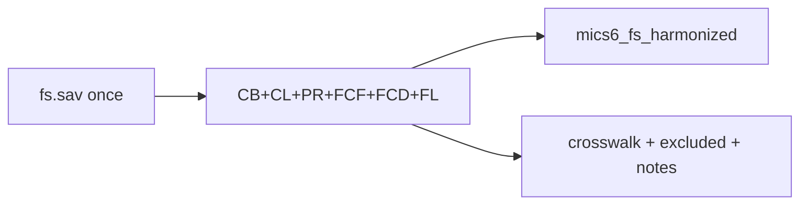

# Add Child Discipline (FCD) to the FS build

## Decisions locked in
- **Scope:** core only — universal discipline methods `FCD2A`–`K` + attitude `FCD5`
- **Depth:** rename + value/variable labels only (no derived “any violent discipline” / MICS PR indicators)
- **Outputs:** extend shared pair only via [`data/harmonize-mics-fs-v1.0.R`](data/harmonize-mics-fs-v1.0.R)
- **Stop double-documenting:** remove `FCD*` from FCF’s exclude path (`harmonize_fcf_from` / `fcf_exclude_reason`); FCD owns its own `excluded` rows

## Core keep list (theme = `FCD`)

Present in **all 19** surveys (`FCD2A`–`K`); attitude in **18/19** as `FCD5` (SLE exception below):

| Harmonized name | Source | Content |
|-----------------|--------|---------|
| `disc_took_privileges` | `FCD2A` | Took away privileges |
| `disc_explained_wrong` | `FCD2B` | Explained why behaviour was wrong |
| `disc_shook` | `FCD2C` | Shook child |
| `disc_shouted` | `FCD2D` | Shouted / yelled / screamed |
| `disc_gave_other_task` | `FCD2E` | Gave something else to do |
| `disc_spanked_hand` | `FCD2F` | Spanked / slapped bottom with bare hand |
| `disc_hit_object` | `FCD2G` | Hit with belt / brush / stick etc. |
| `disc_called_names` | `FCD2H` | Called dumb / lazy / other name |
| `disc_hit_face` | `FCD2I` | Hit / slapped face, head, ears |
| `disc_hit_limb` | `FCD2J` | Hit / slapped hand, arm, leg |
| `disc_beat_hard` | `FCD2K` | Beat as hard as one could |
| `phys_punish_needed` | `FCD5` (else SLE `FCD3`) | Child needs physical punishment to be brought up properly |

**SLE quirk:** file has no `FCD5`; `FCD3` carries the attitude item (same 1/2/8/9 codes). Prefer `FCD5`; if absent, map `FCD3` → `phys_punish_needed` (same pattern as `lang_school` / FL9).

## Excluded (documented under theme `FCD`)
- `FCD3` — filter “caretaker of another under-5” in most surveys (not listed as excluded when consumed as SLE attitude source)
- `FCD4` — already answered attitude filter
- `FCD2L`/`M`/`N` — country extras (COD pull ears; BEN deprive food / lock alone / leave outside; ZWE `FCD2L`)

## Labels
- Methods `FCD2*`: Yes=1, No=2, No response=9
- Attitude: Yes=1, No=2, DK/No opinion=8, No response=9

## Notes sheet
Short `FCD` note: SLE attitude sourced from `FCD3`; no derived violent-discipline composites in this pass.

## Implementation in [`data/harmonize-mics-fs-v1.0.R`](data/harmonize-mics-fs-v1.0.R)

1. Add `core_fcd_sources`, `fcd_rename`, labels, `fcd_exclude_reason`, `harmonize_fcd_from()` (SLE `FCD3`→`phys_punish_needed`).
2. Stop appending `FCD*` to FCF excludes; join FCD in `harmonize_survey()`; extend `apply_fs_labels()` and driver crosswalk/`excluded`/`fs_notes`.
3. Rebuild; verify ~166980 rows; 12 FCD cols; FCD only under theme `FCD` on Excel; SLE `phys_punish_needed` non-all-missing.

## Out of scope
- Derived violent / psychological aggression composites
- Country extras `FCD2L`–`N` as optional columns
- Bookdown chapter
