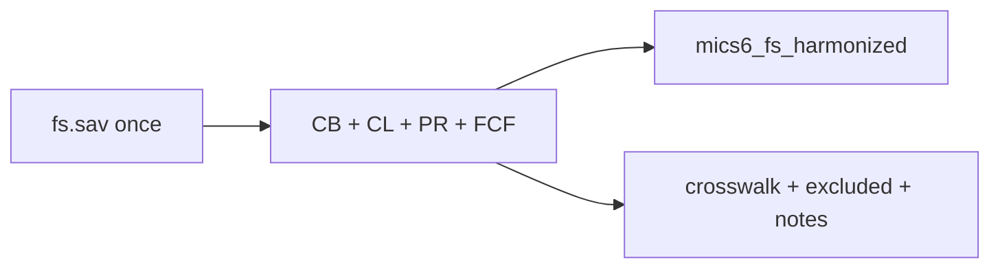

# Add Child Functioning (FCF) to the FS build

## Decisions locked in
- **Scope:** core `FCF*` only; all `FCD*` (Child Discipline) and non-core `FCF*` (e.g. TGO `FCF4`) → `excluded` sheet with clear reasons
- **Depth:** rename + value/variable labels only (no derived functional-difficulty indicators)
- **Outputs:** extend existing shared pair only — [`data/mics6_fs_harmonized.{rds,dta}`](data/mics6_fs_harmonized.rds) and [`data/mics6_fs_variable_crosswalk.xlsx`](data/mics6_fs_variable_crosswalk.xlsx)
- **Entry script:** extend [`data/harmonize-mics-fs-v1.0.R`](data/harmonize-mics-fs-v1.0.R) (same single `fs.sav` pass)

## Core keep list (theme = `FCF`)

Present in all 19 surveys (22 items):

| Harmonized name | Source | Domain |
|-----------------|--------|--------|
| `uses_glasses` | `FCF1` | Seeing aid |
| `uses_hearing_aid` | `FCF2` | Hearing aid |
| `uses_walking_aid` | `FCF3` | Walking aid |
| `difficulty_seeing` | `FCF6` | Seeing |
| `difficulty_hearing` | `FCF8` | Hearing |
| `walk_100_no_aid` | `FCF10` | Walking |
| `walk_500_no_aid` | `FCF11` | |
| `walk_100_with_aid` | `FCF12` | |
| `walk_500_with_aid` | `FCF13` | |
| `walk_100_vs_peers` | `FCF14` | |
| `walk_500_vs_peers` | `FCF15` | |
| `difficulty_self_care` | `FCF16` | Self-care |
| `understood_inside_hh` | `FCF17` | Communication |
| `understood_outside_hh` | `FCF18` | |
| `difficulty_learning` | `FCF19` | Cognition |
| `difficulty_remembering` | `FCF20` | |
| `difficulty_concentrating` | `FCF21` | |
| `difficulty_accepting_change` | `FCF22` | Psychosocial |
| `difficulty_controlling_behaviour` | `FCF23` | |
| `difficulty_making_friends` | `FCF24` | |
| `anxious_nervous_freq` | `FCF25` | Affect |
| `sad_depressed_freq` | `FCF26` | |

Skip questionnaire checks not stored as analysis vars (`FCF4`/`FCF5`/`FCF7`/`FCF9` where present only as filters).

**Excluded:** every `FCD*` (wrong module — Child Discipline); TGO `FCF4` if present; any other non-core `FCF*`.

## Labels
- Aid yes/no (`FCF1`–`3`): `1` Yes, `2` No, `8`/`9` DK/NR if present
- Difficulty items (`FCF6`/`8`/`10`–`24`): standard WG scale — `1` No difficulty, `2` Some, `3` A lot, `4` Cannot at all (+ DK/NR if present)
- Frequency (`FCF25`/`26`): daily / weekly / monthly / a few times a year / never (match SPSS labels)

**Light note (not a PR12-level caveat):** walking item labels say “yards” vs “meters” by survey; codes are treated as comparable. Document one short row on the existing Excel `notes` sheet.

## Implementation in [`data/harmonize-mics-fs-v1.0.R`](data/harmonize-mics-fs-v1.0.R)

1. Add `core_fcf_sources`, `fcf_rename`, `fcf_var_labels`, `fcf_exclude_reason`, `harmonize_fcf_from()` mirroring PR/CL.
2. In `harmonize_survey()`, join FCF on `HH1`/`HH2`/`LN`; include FCF cols in final select.
3. Extend `apply_fs_labels()` for aid / difficulty / frequency value labels.
4. Append `theme = "FCF"` rows to `crosswalk` and `excluded`; append yards/meters note to `fs_notes`.
5. Rebuild; verify nrow ~166980; 22 FCF cols present; FCD only in `excluded`; Excel themes include FCF.

## Out of scope
- Derived “any functional difficulty” indicators
- Child Discipline (`FCD`) as its own theme (later if requested)
- Bookdown chapter
