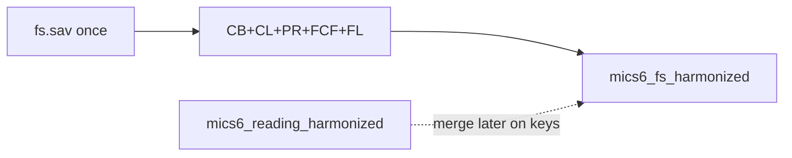

# Add FL numeracy + setup to the FS build

## Decisions locked in
- **Keep:** numeracy items + FL setup/eligibility
- **Exclude:** all reading outcomes/items (already in [`data/mics6_reading_harmonized.{rds,dta}`](data/mics6_reading_harmonized.rds)); document on Excel `notes` + `excluded`
- **Depth:** rename + value/variable labels only (no numeracy scores/skills yet)
- **Outputs:** extend shared pair only via [`data/harmonize-mics-fs-v1.0.R`](data/harmonize-mics-fs-v1.0.R)

## Core keep list (theme = `FL`)

### Setup / eligibility
| Harmonized name | Source | Notes |
|-----------------|--------|--------|
| `fl_consent` | `FL1` | Caregiver permission for FL |
| `child_consent` | `FL3` | Child assent (same name as reading pipeline) |
| `child_reads_books` | `FL6A` | |
| `read_to_child` | `FL6B` | |
| `lang_home` | `FL7` | Country codes (raw) |
| `lang_school` | `FL9` or `FL9A`/`FL9B` | Prefer `FL9`; else `FL9A` with `FL9B` fill (TCD), matching reading |
| `fl_child_result` | `FL28` | Result of child interview 7–14; missing in SLE → `ensure()` |

### Numeracy (all 19 surveys)
| Harmonized name | Source | Domain |
|-----------------|--------|--------|
| `number_id_1`–`6` | `FL23A`–`F` | Number recognition |
| `number_compare_1`–`5` | `FL24A`–`E` | Which number is bigger |
| `number_add_1`–`5` | `FL25A`–`E` | Addition |
| `number_pattern_1`–`5` | `FL27A`–`E` | Missing number |

**Labels:** numeracy items `1` Correct, `2` Incorrect, `3` No attempt (+ NR if present). Consent/books yes/no (`1`/`2`/`9`). Languages keep country value labels where present; variable labels English.

## Excluded (documented)
- All reading FL: word lists (`FL19*`, `FL119*`, `FL219*`, `FLB19*`, …), practice/comprehension (`FL14`–`FL22*`, B/C passages), `FL20A/B`, `FL10`/likestory, etc.
- Other non-core FL: times (`FL2H`/`FL2M`), setup ticks (`FL4*`), `FL26` manual, filters, etc.
- Reason strings distinguish `Reading outcome (see mics6_reading_harmonized)` vs `Outside FL numeracy/setup keep list`

## Notes sheet
Add a short `FL` note: reading outcomes are **not** duplicated here; use `mics6_reading_harmonized` and merge on `country_iso3`, `year`, `HH1`/`HH2`/`LN`. Numeracy is rename-only in this pass.

## Implementation in [`data/harmonize-mics-fs-v1.0.R`](data/harmonize-mics-fs-v1.0.R)

1. Add `core_fl_sources`, `fl_rename`, labels, `fl_exclude_reason`, `harmonize_fl_from()` (lang_school quirk like reading).
2. Join FL into `harmonize_survey()`; extend `apply_fs_labels()` and driver crosswalk/`excluded`/`fs_notes`.
3. Rebuild; verify ~166980 rows; 7 setup + 21 numeracy cols; reading FL only in `excluded`; SLE `fl_child_result` missing OK.

## Out of scope
- Re-deriving reading outcomes into the FS file
- Numeracy scores / foundational numeracy skills indicators
- Bookdown chapter
