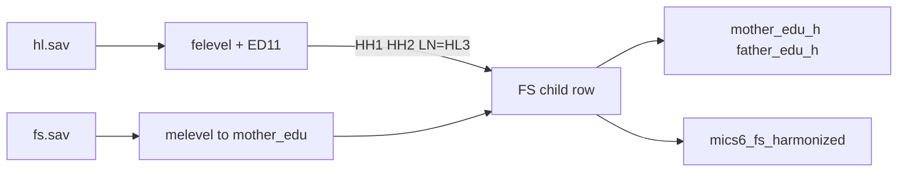

# Add parent education + child school type to FS

## Decisions locked in
- **Mother education:** `melevel` from **`fs.sav`** (already on the child record)
- **Father education:** `felevel` from **`hl.sav`** only (absent from every `fs.sav`) — merge onto the FS child on `HH1`, `HH2`, `LN` = `HL3`
- **Common scheme:** same codes/labels as CB `*_level_h` (0–5, 8, 9)
- **School type:** FS child’s `ED11` from `hl.sav` via the same merge keys; **ED19 out of scope**
- **Outputs:** extend [`data/harmonize-mics-fs-v1.0.R`](data/harmonize-mics-fs-v1.0.R) → shared `mics6_fs_harmonized` + Excel

## Variables (theme = `BG` / background)

| Harmonized | Source | Notes |
|------------|--------|--------|
| `mother_edu` | FS `melevel` | Raw country constructed codes |
| `mother_edu_h` | mapped from `mother_edu` | Common level scheme |
| `father_edu` | HL `felevel` | Raw; merge on child line |
| `father_edu_h` | mapped from `father_edu` | Same scheme |
| `school_type` | HL `ED11` | Child’s current-year school ownership/type |

**`*_edu_h` labels** (reuse `level_h_labels`): 0 ECE/none-ish, 1 Primary, 2 Lower secondary, 3 Upper secondary, 4 Vocational, 5 Higher, 8 DK, 9 missing / no information / parent not in HH.

Per-survey **`parent_level_map_for(iso, year)`** (separate from CB `level_map_for`, because `melevel`/`felevel` are already collapsed). Examples:
- BEN: 0→0, 1→1, 2→2, 3→3, 5→9 (father not in HH), 9→9
- LSO: 1→1 (“Primary or none”), 2→3, 3→5, 7→9, 9→9
- TUN2018: 0→0, 1→1, 3→3, 4→5, 9→9
- ZWE: 99→9; GMB/TGO “Secondary+” → 3; SWZ vocational 4→4
- Document each map on Excel `level_map` with `source` = `mother_edu` / `father_edu` (or a dedicated `parent_level_map` sheet if cleaner)

## School type
- Present **17/19**; missing **GMB, TGO** → `ensure()` missing
- Most surveys: 1 public, 2 religious, 3 private, (4 community), 6 other, 8/9
- **COD** uses a different 1–9 network taxonomy (ENC/ECC/…) — keep **raw codes**, do **not** apply the standard public/private value labels; note on `notes` sheet
- **TUN:** “Other” = 4 (not 6) — keep raw; optional note
- Harmonized name `school_type`; English var label; standard value labels where COD-incompatible surveys are skipped for label overwrite

## Implementation in [`data/harmonize-mics-fs-v1.0.R`](data/harmonize-mics-fs-v1.0.R)

1. Add `harmonize_bg_from(d_fs, d_hl, iso, year)`:
   - From FS: rename `melevel` → `mother_edu`
   - From HL: select `HH1`,`HH2`, `LN`=`HL3`, `felevel`, `ED11`; rename → `father_edu`, `school_type`; left_join to child
   - Apply `parent_level_map_for` → `mother_edu_h`, `father_edu_h`
2. In `harmonize_survey()`, also `read_sav(hl.sav)`; join BG; extend select / labels / crosswalk / excluded / notes
3. Rebuild; verify ~166980 rows; 5 new cols; GMB/TGO `school_type` all NA; father_edu non-missing for most children; Excel theme `BG`

## Out of scope
- ED19 / school feeding
- Rebuilding parent education from raw `ED5A` on the parent’s HL line
- Bookdown chapter
