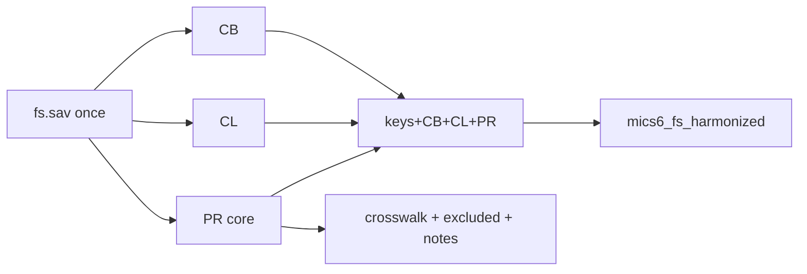

# Add Parental Involvement (PR) to the FS build

## Decisions locked in
- **Scope:** core PR only; country extras → `excluded` sheet
- **Depth:** rename + value/variable labels only
- **Outputs:** extend existing shared pair only — [`data/mics6_fs_harmonized.{rds,dta}`](data/mics6_fs_harmonized.rds) and [`data/mics6_fs_variable_crosswalk.xlsx`](data/mics6_fs_variable_crosswalk.xlsx) (no new theme files/CSVs)
- **Entry script:** extend [`data/harmonize-mics-fs-v1.0.R`](data/harmonize-mics-fs-v1.0.R) (same single `fs.sav` pass as CB/CL)

## Core keep list (theme = `PR`)

| Harmonized name | Source | Notes |
|-----------------|--------|--------|
| `child_books` | `PR3` | count; special codes preserved |
| `had_homework` | `PR5` | yes/no/DK |
| `homework_help` | `PR6` | |
| `school_governing_body` | `PR7` | |
| `attended_pta_meeting` | `PR8` | |
| `meeting_discussed_plan` | `PR9A` | |
| `meeting_discussed_budget` | `PR9B` | |
| `received_report_card` | `PR10` | |
| `visited_school_event` | `PR11A` | |
| `discussed_progress_teachers` | `PR11B` | |
| `school_closed_a` | `PR12A` | **country-specific meaning** |
| `school_closed_b` | `PR12B` | **country-specific meaning** |
| `school_closed_c` | `PR12C` | **country-specific meaning** |
| `school_closed_other` | `PR12X` | |
| `missed_class_teacher_absent` | `PR13` | |
| `contacted_school_officials` | `PR15` | |

Skip checks/filters not stored as analysis vars (`PR1`, `PR4`, `PR14`, `PR16`, `PR19`).

**Excluded (documented):** LSO `PR17*`/`PR18*`/`PR20`; BEN `PR4A`/`PR11C`; COD/NGA/SWZ `PR12D`; TGO `PR2`; any other non-core `PR*`.

## Document the PR12 caveat

Do this in the shared workbook (no separate CSV):

1. **`crosswalk` sheet:** for `school_closed_a/b/c`, set `variable_label` to a neutral label that flags the issue, e.g. `School closed in last 12 months — reason slot A (country-specific meaning; see notes)`.
2. **New sheet `notes`:** one row (or few) documenting that `PR12A`–`C` / `school_closed_a`–`c` are **not cross-country comparable** as coded (example: most surveys A=natural / B=man-made / C=teacher strike; NGA A=COVID-19, B=other epidemics/disasters, C=man-made, D=teacher strike excluded from core). Point users to SPSS value labels / country questionnaires.
3. Optionally add a `notes` column on those three crosswalk rows with a short pointer: `See sheet notes`.

Labels on yes/no/DK items: `1` Yes, `2` No, `8` DK, `9` No response (match SPSS where present). `child_books`: keep numeric; label common specials (`0` none if labelled; `98`/`99` if used).

## Implementation in [`data/harmonize-mics-fs-v1.0.R`](data/harmonize-mics-fs-v1.0.R)

1. Add `core_pr_sources`, `pr_rename`, `pr_var_labels`, `pr_exclude_reason`, `harmonize_pr_from()` mirroring CL.
2. In `harmonize_survey()`, after CB+CL, join PR on `HH1`/`HH2`/`LN`; include PR cols in final select.
3. Extend `apply_fs_labels()` for PR yes/no/DK and books.
4. Append PR rows to `crosswalk` (`theme = "PR"`) and `excluded`; add `notes` sheet in `write_fs_workbook()`.
5. Rebuild; verify nrow still ~166980; PR present for all 19 surveys; LSO extras only in `excluded`; NGA `school_closed_a` still maps from `PR12A` with caveat documented.

## Out of scope
- Harmonising `PR12` into common closure categories
- LSO absence-reason blocks
- Derived involvement indices
- Bookdown chapter
