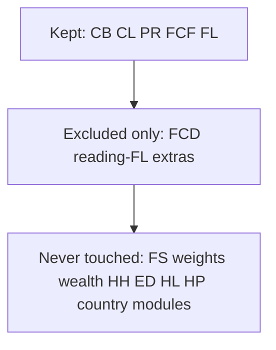

# Remaining FS variables (post CB/CL/PR/FCF/FL)

Scanned all 19 folders under [`data/MICS_Datasets/`](data/MICS_Datasets/) and compared names to what [`data/harmonize-mics-fs-v1.0.R`](data/harmonize-mics-fs-v1.0.R) already **keeps** or **lists on `excluded`** under prefixes `CB*`, `CL*`, `PR*`, `FCF*`, `FCD*`, `FL*` (+ keys `HH1`/`HH2`/`LN`).

## Already handled (not leftovers)

| Theme | Status |
|-------|--------|
| **CB** | Core kept; extras on `excluded` |
| **CL** | Core kept; extras on `excluded` |
| **PR** | Core kept; extras on `excluded` |
| **FCF** | Core kept; filters/extras on `excluded` |
| **FL** | Numeracy + setup kept; reading + other FL on `excluded` (reading → `mics6_reading_harmonized`) |
| **FCD** | Present in **all 19** surveys; only **excluded** under FCF (“Child Discipline — not Child Functioning”). **Not** a keep theme yet |

## Never considered (no keep, no exclude row)

These sit outside the five theme prefixes. Leftover counts per survey are typically **~50–100** (CAF **168** because of country modules).

### A. Universal / near-universal (all or almost all 19)

1. **FS Child Information Panel** (`FS1`–`FS17`, `FSINT`, `FSHINT`, `FSFIN`, `FSDOI`, `FSDOB`, `FSAGE`, plus long country-specific `FS15*` respondent blocks in BEN/NGA/SWZ) — interview admin: consent, times, languages, result (`FS17`), caretaker line (`FS4`).
2. **Weights / age constructs** — `fsweight`, `fshweight`, `fsage`/`FSAGE`, `schage`/`fsSchage`, `fselevel`, `fsdisability`, `fsinsurance`.
3. **Wealth** — `wscore`/`wscorer`/`wscoreu`, `windex5*`/`windex10*`.
4. **HH geography / interviewer** (beyond HH1/HH2) — `HH3`, `HH4`, `HH6`/`HH6A`, `HH7`/`HH7A`, sometimes `HH52`, aux region codes.
5. **Household roster scraps** — `HL4` (sex), sometimes `HL7`.
6. **Mother/caretaker education mirrors** — `ED5A`/`ED5B` (and rarer `ED10A`/`ED11`/`ED6B*`) in most surveys.
7. **Background constructed** — `melevel`, `caretakerage`/`caretakerdis`, `religion`/`ethnicity`, `stratum`/`PSU`/`zone`, language codes, etc. (names vary by survey).

### B. Lesotho form theme never built

- **HPV (`HP*`)** — **LSO only** (19 vars): card, HPV1/2 dates, campaign participation, doses.

### C. Country-only modules (never touched)

| Module | Surveys | What it is |
|--------|---------|------------|
| **ECB / ECL / ECF** | CAF only | Parallel child background / labour / functioning for another age group (mirrors CB/CL/FCF) |
| **VCT** | CAF only | Vocational/technical training |
| **NSR** | CAF only | Reasons for non-attendance |
| **TN*** | CAF, GMB, MDG, SLE, STP, TCD, TGO | Mosquito net / malaria-related |
| **CMT** | MDG only | ICT (computer/tablet/internet/phone) |
| **BRS / FBR / FMT** | NGA / STP / TUN2023 | Birth registration or ICT-like country block |

\*TN also has `TNLN` in some files.

## Per-survey leftover size (approx.)

- Typical: **COD/GHA/GNB/MWI/ZWE ~53–55**; **TUN2018 ~47**
- Larger FS15 blocks: **BEN/NGA/SWZ ~96–102**
- Country modules: **CAF ~168**; **LSO ~73** (includes HP); **GMB/SLE/TGO/TCD/STP ~63–70** (often TN)

## Suggested next keep theme (if continuing the Lesotho form order)

**Child Discipline (`FCD*`)** is the only core form module that is still only excluded, not harmonized — present in every survey (`FCD2A`–`K` discipline items, `FCD3`–`FCD5`).

Everything else is either interview/design metadata (FS/weights/wealth/HH), LSO-only HPV, or country add-ons.

